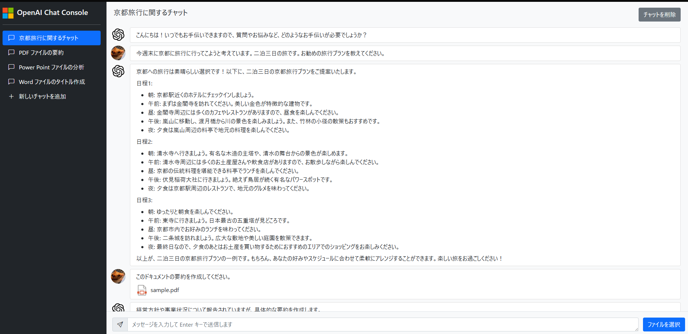

# Azure OpenAI Service Chat API のクライアント

## 使い方

[openai_settings.json](./openai_settings.json) のプロパティ ```OPENAI_NAME``` に使用する Azure OpenAI Service のアカウント名を、プロパティ ```OPENAI_KEY``` に認証キーを、```OPENAI_MODEL``` に使用するモデルのデプロイメント名を指定します。

```json
{
    "OPENAI_NAME": "{使用する Azure OpenAI Service のアカウント名を入力}",
    "OPENAI_KEY": "{使用する Azure OpenAI Service の認証キーを入力}",
    "OPENAI_MODEL": "{使用する Azure OpenAI Service のデプロイメント名を入力}",
    "OPENAI_API_VERSION": "2023-06-01-preview",
    "OPENAI_SYSTEM_MESSAGE": "あなたは、人々が情報を見つけるのを助けるAIアシスタントです。指示に対して全て日本語で回答してください。",
    "OPENAI_PROMPT_FORMAT": "以下の文章について、指定された指示通りの処理を行ってください。\n\n# 指定された指示\n{user_message}\n\n# 対象の文章\n{text}",
    "OPENAI_TEXT_SPLIT_SIZE": 10000,
    "OPENAI_MAX_TOKEN": 3000,
    "OPENAI_TEMPERATURE": 0,
    "OPENAI_CHAT_HISTORY_TAKE": 10
}
```

## ローカル環境での実行方法

以下のコマンドを実行して Python モジュールをインストールします。
```bash
pip install -r requirements.txt
```

以下の通りに [localrun.sh](./localrun.sh) を実行して、Web アプリケーションを起動します。
```bash
./localrun.sh
```

```http://127.0.0.1:5000``` を Web ブラウザで開くことで、アプリケーションを利用することができます。



## Azure へのデプロイ方法

以下の通りに [deploy.sh](./deploy.sh) を実行して、Web アプリケーションを Azure へデプロイします。第一引数にはデプロイ先のリソースグループ名を指定する必要があります。
```bash
./deploy.sh {デプロイ先のリソースグループ名}
# [例] ./deploy.sh rg-simple-aoi-console
```
